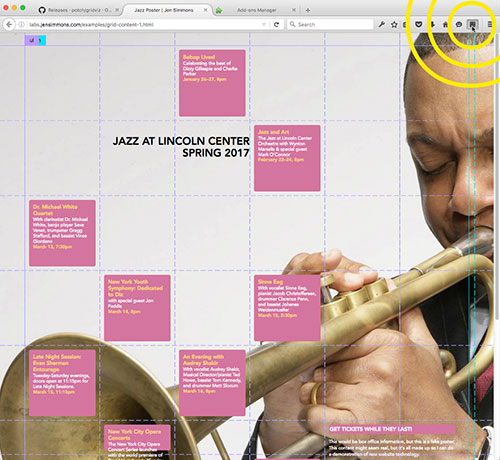

#CSS Grid Visualizer

[CSS Grid](https://drafts.csswg.org/css-grid/) is awesome. It's more awesome if you can see the lines while you are defining the grid. So we here at the Mozilla Developer Relations Team created this first-draft of a tool. Use it to see your grid. 

This tool works only in Firefox. If you download and use [Firefox Nightly](https://nightly.mozilla.org/), you'll have the most-complete implementation of CSS Grid, and you don't have to flip a flag to make it work. It will Just Work™. 

##To install this Add-On:
1. Open Firefox. [Nightly](https://nightly.mozilla.org/) is best.
2. Go to the [release page](https://github.com/potch/gridviz/releases), and click to download the most recent version of the the .xpi file.
3. Firefox will offer to install it for you. Say yes, please. 
4. Use it by clicking the new icon in the upper right corner of the browser. 
5. Enjoy! And [file issues](https://github.com/potch/gridviz/issues) with new ideas, feature requests, and bug reports. We need your help to make this better.

Need more help? Watch [this silent movie](howtoinstall.gif).